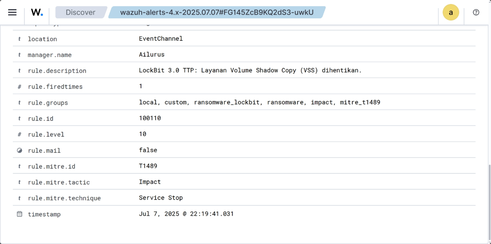
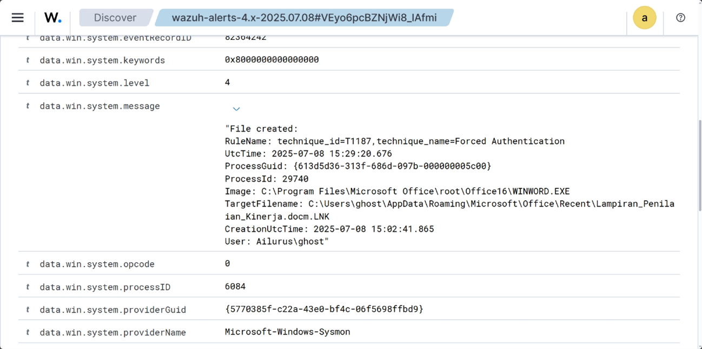
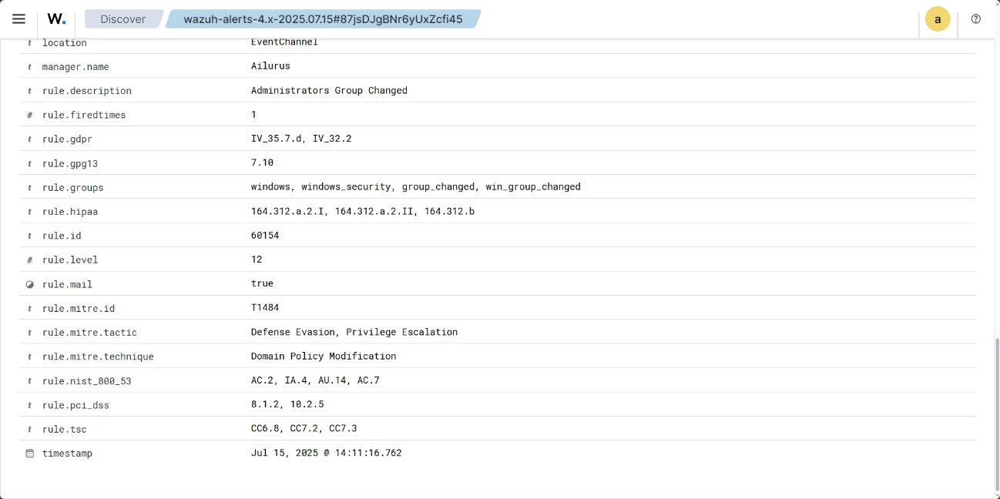
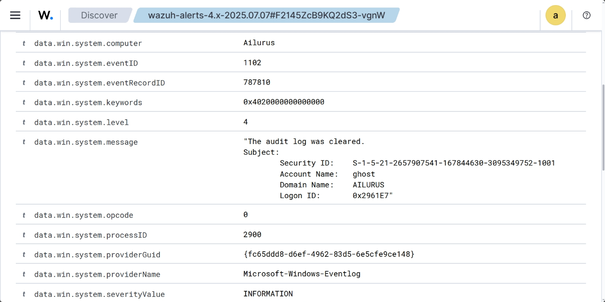

# 🛡️ Wazuh SIEM Implementation: Ransomware & Phishing Threat Detection

### 📋 Project Overview
This project demonstrates the design and implementation of a **Security Information and Event Management (SIEM)** solution using **Wazuh** integrated with **Windows Sysmon**. The primary objective was to build a detection engineering lab capable of identifying advanced threats based on the **MITRE ATT&CK** framework.

This work is part of my Bachelor's Thesis: *"Implementasi Wazuh, MITRE ATT&CK, dan Windows Sysmon untuk Deteksi Ransomware serta Phishing".*

### 🛠️ Tech Stack & Tools
* **SIEM Core:** Wazuh (Manager, Indexer, Dashboard)
* **Endpoint Telemetry:** Windows Sysmon (System Monitor)
* **Framework:** MITRE ATT&CK
* **Operating Systems:** Ubuntu Server (Wazuh Host), Windows 11 (Endpoint)
* **Scripting:** XML (Custom Detection Rules), Bash, Batch Scripting

### 🎯 Key Capabilities
1.  **Ransomware Detection (LockBit 3.0 Simulation)**
    * Detection of Volume Shadow Copy deletion (`vssadmin.exe`).
    * Monitoring file encryption activities via FIM (File Integrity Monitoring).
    * **MITRE Tactic:** Impact (T1490).
2.  **Phishing Detection (BEC / MalDoc Simulation)**
    * Detection of malicious macro execution (PowerShell spawned by Office apps).
    * Identification of suspicious outbound traffic.
    * **MITRE Tactic:** Initial Access (T1566), Execution (T1059).
3.  **Persistence & Evasion Detection**
    * Monitoring privilege escalation (Admin group changes).
    * Detecting attempts to clear Windows Event Logs.

---

## 📊 Detection Evidence & Analysis

Below are the actual alert logs captured during the simulation, demonstrating the detection capabilities of the Wazuh rules I configured.

### 1. Ransomware Detection: Shadow Copy Deletion
**Scenario:** The ransomware attempts to delete volume shadow copies using `vssadmin.exe` to prevent system recovery.
**Detection Rule:** Custom Rule ID `100110` (Mapped to MITRE T1489).

> **Analysis:** The log above confirms that Wazuh successfully detected the execution of `vssadmin.exe delete shadows`. The alert level was raised to `10` (High) due to the destructive nature of this command, which is a primary indicator of ransomware activity.

### 2. Phishing Detection: Malicious Macro Execution
**Scenario:** A user opens a malicious Word document (`WINWORD.EXE`), which then spawns PowerShell to execute a payload.
**Detection Rule:** Sysmon Event ID 1 (Process Creation) correlated with Wazuh rules.

> **Analysis:** The log clearly captures the parent process `WINWORD.EXE` launching `powershell.exe`. This parent-child process relationship is a classic indicator of a macro-based attack vector used in Phishing/BEC campaigns.

### 3. Persistence: User Group Manipulation
**Scenario:** The attacker adds a rogue user to the "Administrators" group to maintain high-level access.
**Detection Rule:** Windows Security Event ID 4732.

> **Analysis:** This alert flags a critical security event where a user was added to a privileged group. In a real SOC environment, this would trigger an immediate incident response workflow to verify if the change was authorized.

### 4. Evasion: Log Clearing
**Scenario:** The attacker attempts to cover their tracks by clearing the Windows Audit Logs.
**Detection Rule:** Security Event ID 1102.

> **Analysis:** Clearing event logs is a high-confidence indicator of compromise. Wazuh detected this evasion attempt immediately, ensuring that the security team is aware even if local logs are wiped.

---

### ⚙️ Configuration & Rules
This repository contains the custom configurations used to achieve the detections above:

* `/rules/local_rules.xml`: Custom XML rules written to detect specific TTPs that default rules missed.
* `/configs/sysmonconfig.xml`: Optimized Sysmon configuration to capture relevant Event IDs (1, 3, 11, etc.).
* `/configs/ossec.conf`: Wazuh Agent configuration for File Integrity Monitoring (FIM).

### 🚀 How to Replicate
1.  **Environment Setup:** Install Wazuh Manager on a Linux server and Wazuh Agent on a Windows endpoint.
2.  **Sysmon Integration:** Install Sysmon on the endpoint using the provided `sysmonconfig.xml`.
3.  **Rule Deployment:** Import `local_rules.xml` to `/var/ossec/etc/rules/` on the Manager.
4.  **Restart:** Restart Wazuh Manager to apply changes.
5.  **Testing:** Run the simulation scripts provided in the `/simulation-scripts` folder (⚠️ **Safe Environment Only**).

---
**Disclaimer:** The malware simulation scripts and techniques discussed here are for educational and research purposes only. Do not execute them on production systems or networks without authorization.
